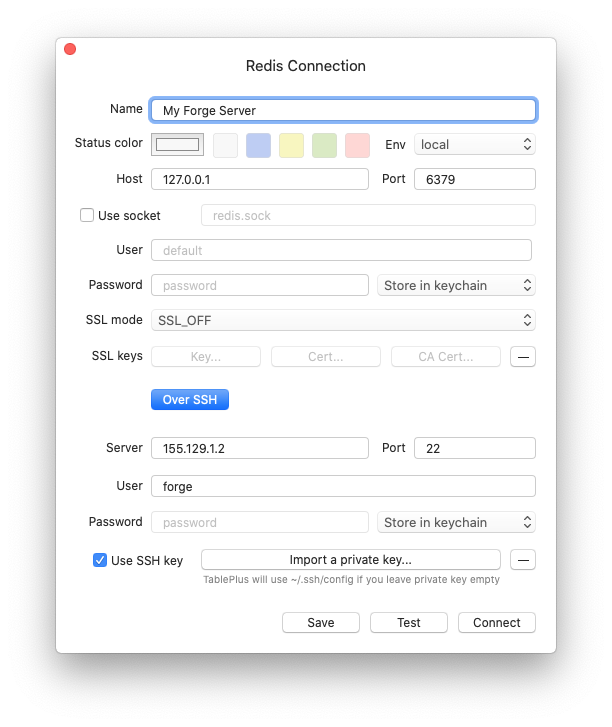

# Caches

## Overview

When provisioning an [App Server](/servers/types#app-servers) or a [Cache Server](/servers/types#cache-servers), Forge will automatically install [Memcache](https://www.memcached.org/) and [Redis](https://redis.io/). By default, neither of these services are exposed to the public and may only be accessed from within your server.

## Connecting To Redis

Redis and Memcache are both available via `127.0.0.1` and their default ports.

```bash
MEMCACHED_HOST=127.0.0.1
MEMCACHED_PORT=11211

REDIS_HOST=127.0.0.1
REDIS_PASSWORD=null
REDIS_PORT=6379
```

## External Connections

All Forge servers require SSH key authentication and are not able to be accessed using passwords. Therefore, when selecting the SSH key to use during authentication, ensure that you select your private SSH key. For example, when connecting to Redis using the [TablePlus](https://tableplus.com/) database client:


